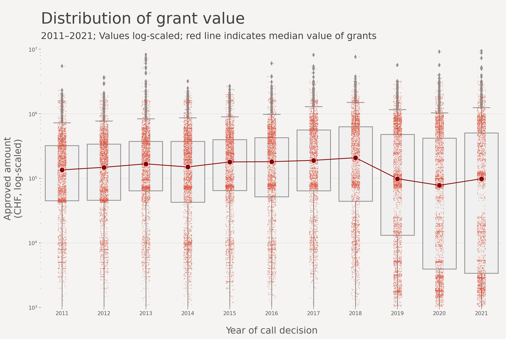

# SNSF open data: Who gets funding? 

**How to calculate figures yourself – with Python**

The Swiss National Science Foundation (SNSF) provides [comprehensive data sets](https://data.snf.ch/datasets) about their funding. In addition to their [elaborated and aesthetic data stories](https://data.snf.ch/stories) they published [a starter kit for R](https://data.snf.ch/stories/snsf-open-data-who-gets-funding-en.html), that shows how interested parties can analyse the open data in R. 

I rewrote the code in Python to simplify access for people that aren't familiar with R. For all details about the data and these first steps in EDA see [the original starter kit](https://data.snf.ch/stories/snsf-open-data-who-gets-funding-en.html).

